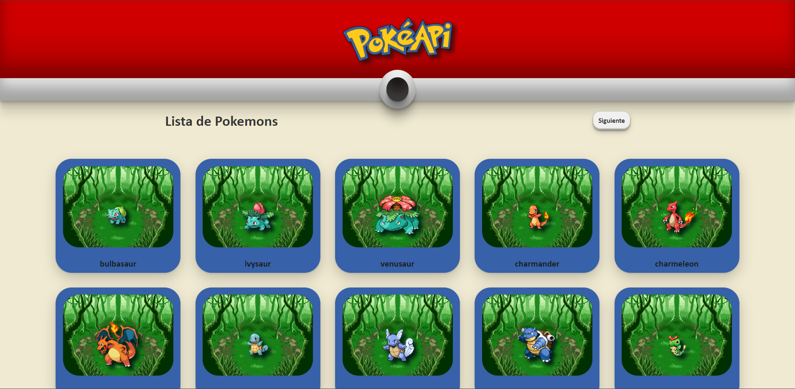

    

---

    

## 🖥️ Desplegado

Porque no entras y encuentras tus pokemons favoritos y descubres todas sus habilidades en : [Netlify solo tienes que dar clic aqui](https://pokemon-poke-api.netlify.app/)

## 🚀 Instalación

1. Clona este proyecto.
2. Ve a la carpeta del proyecto
   `poke-api-react`
3. Instala las dependencias
   `npm install`
4. Corre en local
   `npm run start`
